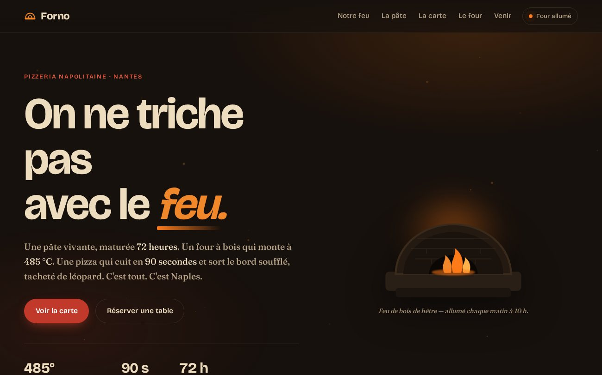
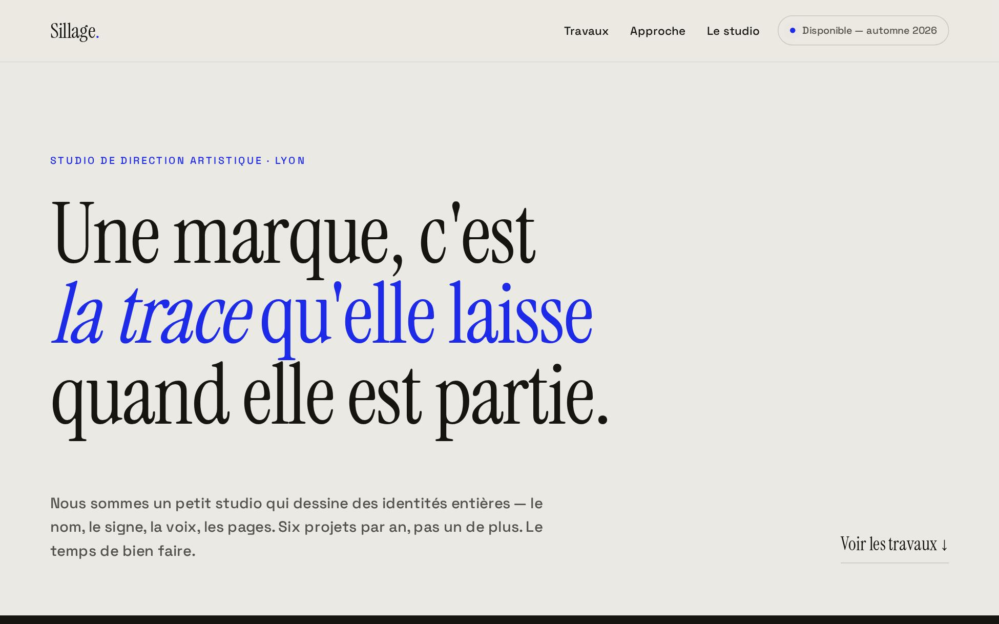
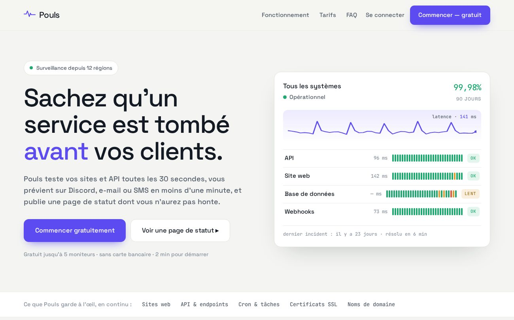

<div align="center">

# 🎨 Démos front-end — MatgordFR

### Trois sites, trois métiers, **zéro dépendance.**

Le **hub** qui rassemble mes trois démos front-end. Chacune vit dans son propre dépôt,<br>
et cette page les présente d'un coup d'œil. Vanilla (HTML/CSS/JS), sans framework, sans CDN.


[](https://matgordfr.github.io/matgord-portfolio-demos/)

</div>

> [!NOTE]
> **Projets démo.** Entreprises, produits, personnes et données **entièrement fictifs** — des vitrines de savoir-faire, pas des sites en production. Tout tourne dans le navigateur, sans backend.

---

## Les trois démos

| | Démo | Métier | Démo live | Code |
|---|---|---|---|---|
| 🔥 | **Forno** | One-pager restauration — pizzeria, four vivant, **cuisson interactive de 90 s** | [ouvrir ↗](https://matgordfr.github.io/forno-demo/) | [forno-demo](https://github.com/MatgordFR/forno-demo) |
| ✷ | **Sillage** | Portfolio studio créatif — **curseur custom** & **affiches génératives** | [ouvrir ↗](https://matgordfr.github.io/sillage-demo/) | [sillage-demo](https://github.com/MatgordFR/sillage-demo) |
| 📈 | **Pouls** | Landing produit / SaaS — **board vivant**, pricing mensuel/annuel, FAQ | [ouvrir ↗](https://matgordfr.github.io/pouls-demo/) | [pouls-demo](https://github.com/MatgordFR/pouls-demo) |

<div align="center">

### 🔥 [Forno](https://matgordfr.github.io/forno-demo/)
[](https://matgordfr.github.io/forno-demo/)

### ✷ [Sillage](https://matgordfr.github.io/sillage-demo/)
[](https://matgordfr.github.io/sillage-demo/)

### 📈 [Pouls](https://matgordfr.github.io/pouls-demo/)
[](https://matgordfr.github.io/pouls-demo/)

</div>

---

## Le parti pris, sur les trois

- **Zéro dépendance** — pas de framework, pas de librairie de graphiques, pas de CDN, pas de build.
- **Une identité par démo** — palette, typographie et animations dérivées du sujet, jamais un gabarit recyclé.
- **Polices auto-hébergées** — Bricolage Grotesque, Fraunces, Instrument Serif, Space Grotesk, JetBrains Mono. Aucune requête tierce, aucun pisteur.
- **Graphismes dessinés** — icônes, illustrations et graphiques en SVG écrit à la main ; l'art des affiches de *Sillage* est **généré** au chargement.
- **Léger & rapide** — chaque démo pèse ~100 Ko, se charge d'un coup.
- **Accessible & responsive** — navigation clavier, focus visible, `prefers-reduced-motion` respecté, du grand écran au mobile sans débordement.

## 🛠️ Stack


## 📁 Structure

Ce dépôt = **le hub uniquement**. Les démos sont dans leurs propres dépôts (voir la table ci-dessus).

```
index.html            → le hub (cette page d'accueil)
assets/css/hub.css    → styles du hub
assets/js/hub.js      → reveals au scroll
assets/fonts/         → Bricolage + Space Grotesk (auto-hébergées)
assets/thumbs/        → vignettes des trois démos
```

## 🚀 Lancer en local

```bash
python3 -m http.server 8000
# puis http://localhost:8000
```

## 👤 Auteur

Réalisé par **[MatgordFR](https://github.com/MatgordFR)** — dev indépendant (bots Discord, sites, IA).
🌐 [matgord.com](https://matgord.com) · 🐦 [@matgordfr](https://x.com/matgordfr)

## 📄 Licence

[ISC](LICENSE) — libre d'usage.
